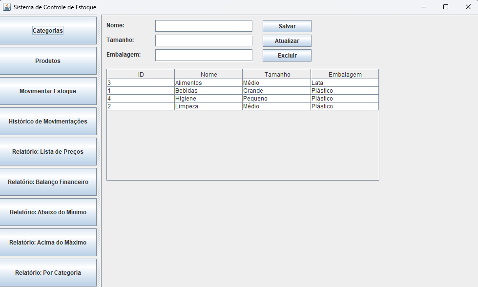
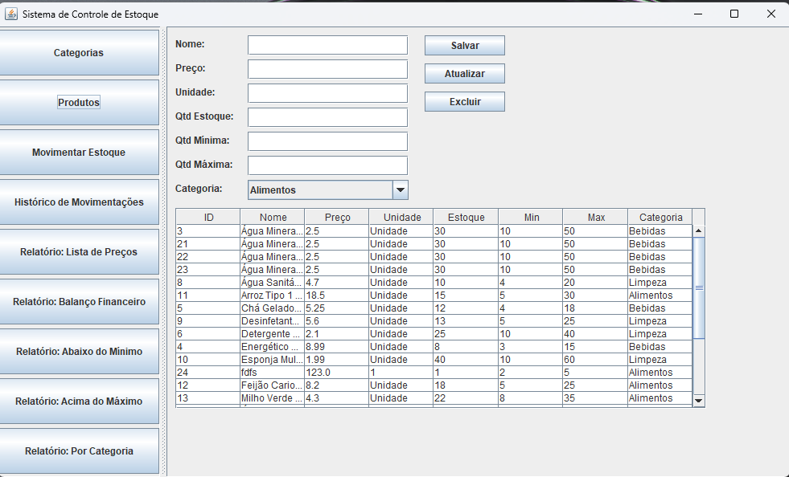

# 📦 Sistema de Controle de Estoque

## 👨‍💻 Integrantes do Projeto
- MARCOS ANTONIO GASPERIN – RA: 10724265643
- ERIK MARTINS - RA: 10724270275
- VITOR FABIANO DA SILVA - RA: 10724262853

## 📝 Descrição do Projeto
Este projeto tem como objetivo criar um sistema de controle de estoque utilizando Java e MySQL. O sistema permite o cadastro de categorias, produtos, movimentações de entrada e saída, além da geração de relatórios.

**Arquitetura do Sistema:**
- 🖥️ **Aplicação Desktop:** Interface Swing para uso local
- 🌐 **Aplicação Web:** Interface JSP/Servlets para acesso via navegador
- 🔌 **API REST:** WebServices RESTful para integração distribuída e consumo por diferentes clientes

Foi desenvolvido como atividade prática da Universidade do Sul de Santa Catarina – UNISUL.

## 🚀 Funcionalidades Principais

### Interface Desktop (Swing)
- ✅ Cadastro de Categorias (CRUD)
- ✅ Cadastro de Produtos (CRUD)
- ✅ Controle de Movimentações (Entrada e Saída)
- ✅ Histórico de Movimentações
- ✅ Relatórios:
  - Lista de preços
  - Balanço físico e financeiro
  - Produtos abaixo do mínimo
  - Produtos acima do máximo
  - Quantidade de produtos por categoria

### Interface Web + API REST
- ✅ CRUD completo de Categorias, Produtos e Movimentações
- ✅ Endpoints RESTful (JSON)
- ✅ CORS habilitado para arquitetura distribuída
- ✅ Dashboard com estatísticas em tempo real
- ✅ 6 tipos de relatórios gerenciais
- ✅ Suporte para front-end desacoplado

## 🔧 Tecnologias Utilizadas
| Tecnologia | Versão | Finalidade |
|-------------|--------|------------|
| Java        | 8      | Linguagem principal |
| Maven       | 3.9.6  | Gerenciamento de dependências |
| MySQL       | 8.0+   | Banco de dados |
| Swing (Java)| -      | Interface desktop |
| Servlet API | 4.0.1  | Controladores web |
| JSP + JSTL  | 2.3.3  | Interface web |
| JAX-RS      | 2.1.1  | Especificação REST API |
| Jersey      | 2.35   | Implementação JAX-RS |
| Jackson     | 2.15.2 | Serialização JSON |
| Tomcat      | 9.0+   | Servidor de aplicação |
| Git/GitHub  | -      | Controle de versão |

## 📜 Requisitos Funcionais
- RF01 – O sistema deve permitir o cadastro de categorias.
- RF02 – O sistema deve permitir o cadastro de produtos.
- RF03 – O sistema deve permitir controlar entradas e saídas de produtos.
- RF04 – O sistema deve gerar relatórios conforme a necessidade do usuário.
- RF05 – O sistema deve exibir um histórico de movimentações.
- RF06 – O sistema deve fornecer API REST para integração com outros sistemas.
- RF07 – O sistema deve suportar arquitetura distribuída (front-end e back-end separados).

## 🚫 Requisitos Não Funcionais
- RNF01 – O sistema deve ser desenvolvido na linguagem Java.
- RNF02 – O banco de dados utilizado deve ser MySQL.
- RNF03 – A interface desktop deve utilizar Swing.
- RNF04 – O sistema deve ter fácil usabilidade e ser leve.
- RNF05 – O controle de versão deve ser feito no GitHub.
- RNF06 – A API REST deve seguir padrões RESTful e retornar JSON.
- RNF07 – O sistema web deve suportar CORS para requisições cross-origin.

## 🏗️ Arquitetura do Sistema

O projeto possui **três modos de execução**:

1. **Aplicação Desktop Standalone** 
   - Interface Swing local
   - Conexão direta com MySQL
   - Execução via `java -jar ControleEstoque-1.0.jar`

2. **Aplicação Web Monolítica**
   - Interface JSP/Servlets
   - Deploy em Tomcat via `controle-estoque-web.war`
   - Acesso via navegador

3. **Arquitetura Distribuída (REST API)**
   - Back-end: API REST com JAX-RS/Jersey
   - Front-end: Pode ser qualquer cliente (React, Angular, Vue, Mobile, etc.)
   - Comunicação via HTTP/JSON com CORS habilitado

**📂 Documentação Técnica:**
- [Arquitetura Detalhada](./docs/ARQUITETURA.md)
- [Projeto Completo](./docs/PROJETO-COMPLETO.md)
- [Documentação da API REST](./docs/API-REST-DOCUMENTACAO.md)
- [Guia de Deploy no Tomcat](./docs/DEPLOY-TOMCAT.md)

## 🔌 API REST - Endpoints Principais

Base URL: `http://localhost:8080/controle-estoque-web/api`

### Produtos
- `GET /produtos` - Listar todos os produtos
- `POST /produtos` - Criar novo produto
- `PUT /produtos/{id}` - Atualizar produto
- `DELETE /produtos/{id}` - Excluir produto

### Categorias
- `GET /categorias` - Listar todas as categorias
- `POST /categorias` - Criar nova categoria
- `PUT /categorias/{id}` - Atualizar categoria
- `DELETE /categorias/{id}` - Excluir categoria

### Movimentações
- `GET /movimentacoes` - Listar movimentações
- `POST /movimentacoes` - Registrar movimentação
- `GET /movimentacoes/produto/{id}` - Movimentações por produto

### Relatórios
- `GET /relatorios/dashboard` - Dashboard completo
- `GET /relatorios/produtos-abaixo-minimo` - Produtos com estoque baixo
- `GET /relatorios/produtos-acima-maximo` - Produtos com excesso de estoque
- `GET /relatorios/lista-precos` - Lista de preços
- `GET /relatorios/balanco-financeiro` - Balanço físico e financeiro
- `GET /relatorios/produtos-por-categoria` - Agrupamento por categoria

> 📖 **Documentação completa:** [API-REST-DOCUMENTACAO.md](./docs/API-REST-DOCUMENTACAO.md)

## ⚙️ Como Executar

### 1️⃣ Aplicação Desktop
```bash
# Compilar
mvn clean package

# Executar
java -jar target/ControleEstoque-1.0.jar
```

### 2️⃣ Aplicação Web
```bash
# Compilar WAR
cd web-app
mvn clean package

# Deploy manual no Tomcat
# Copiar web-app/target/controle-estoque-web.war para TOMCAT_HOME/webapps/

# Acessar
http://localhost:8080/controle-estoque-web
```

### 3️⃣ API REST (Arquitetura Distribuída)
```bash
# Mesmo processo da aplicação web
# Endpoints disponíveis em:
http://localhost:8080/controle-estoque-web/api/

# Exemplo de requisição
curl -X GET http://localhost:8080/controle-estoque-web/api/produtos \
  -H "Content-Type: application/json"
```

> 📖 **Guia completo de deploy:** [DEPLOY-TOMCAT.md](./docs/DEPLOY-TOMCAT.md)

## 🖥️ Telas do Sistema


### 🔸 Cadastro de Categorias


### 🔸 Cadastro de Produtos


### 🔸 Movimentação de Estoque


### 🔸 Histórico de Movimentações


## 📊 Relatórios Gerados

### 📑 Lista de Preços


### 📑 Balanço Financeiro


### 📑 Produtos Abaixo do Mínimo


### 📑 Produtos Acima do Máximo


### 📑 Produtos por Categoria


## 📚 Fontes
- UNISUL – Manual de Metodologia Acadêmica.
- Documentação Java (https://docs.oracle.com)
- Documentação MySQL (https://dev.mysql.com)
- GitHub – Repositório base do projeto: https://github.com/osmarbraz/CadastroAlunoMySQLDAO

## 🧾 Licença
Este projeto é acadêmico, sem fins lucrativos, desenvolvido apenas para fins de aprendizagem **UNISUL**.

## 🔗 Link do Projeto no GitHub
👉 [https://github.com/bulinrutss/ProjetoEstoque](https://github.com/bulinrutss/ProjetoEstoque)
